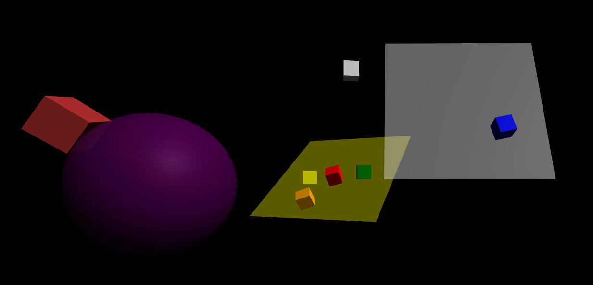

# aframe-snapto-component

The **snapto** component provides helpers for snapping entities to a grid, or to the ground (either position or position and slope). 

Generally **snapto** is used at entity creation time, but it can also be set to continuous (with a slight performance hit) for objects 
that move or grounds that change shape.

When snapping with **hitnormal**, the default y-axis is aligned to the ground normal, and the default x and z axis are tangential to the ground normal.

## [Demo](https://harlyq.github.io/aframe-snapto-component/)



## Example
```html
<head>
  <script src="https://aframe.io/releases/0.8.0/aframe.min.js"></script>
  <script src="https://unpkg.com/aframe-snapto-component/dist/aframe-snapto-component.min.js"></script>
</head>
<body>
  <a-box snapto="type: hitnormal; offset: 0 0.5 0;"></a-box>
  <a-plane color="white" rotation="-20 0 0" scale="5 5 5" opacity="0.5"></a-plane>
</body>
```

## Attributes
| Property | Description | Default Value | Type |
| -------- | ----------- | ------------- | ---- |
|continuous|if true, perform the snap every frame, good for moving objects, but computationally expensive (cannot be changed at runtime)|false|boolean|
|direction|_if **type** is 'hitposition' or 'hitnormal'_. world direction of the ray for the snap test|{x: 0, y: -1, z: 0}|vec3|
|grid|_if **type** is 'gridsnap'_. grid spacing, centered on 0,0,0|{x: 1, y: 1, z: 1}|vec3|
|objects|_if **type** is 'hitposition' or 'hitnormal'_. selector for determining which objects for the raycast, by default checks against all other objects in the scene|'*'|string|
|offset|offset (in local coordinates) to apply to the node after it has been snapped into place|{x: 0, y: 0, z: 0}|vec3|
|rayStart|_if **type** is 'hitposition' or 'hitnormal'_. start point along the 'direction' for the ray from the entities origin, can use -ve values to start behind the entity|0|number|
|type|align the object to either the position of the hit pointing UP (hitposition), to the hit position with the up in the direction of the normal (hitnormal), or grid position (gridsnap)|'hitposition'|string|

## Limitations
*hitposition* and *hitnormal* do not work correctly when hitting the back-side of a two sided material, they will force the object to the front-side.

Ideally the **snapto** component is placed at the end of the html line, so any other components that re-position the entity will occur before the entity is snapped to position.

